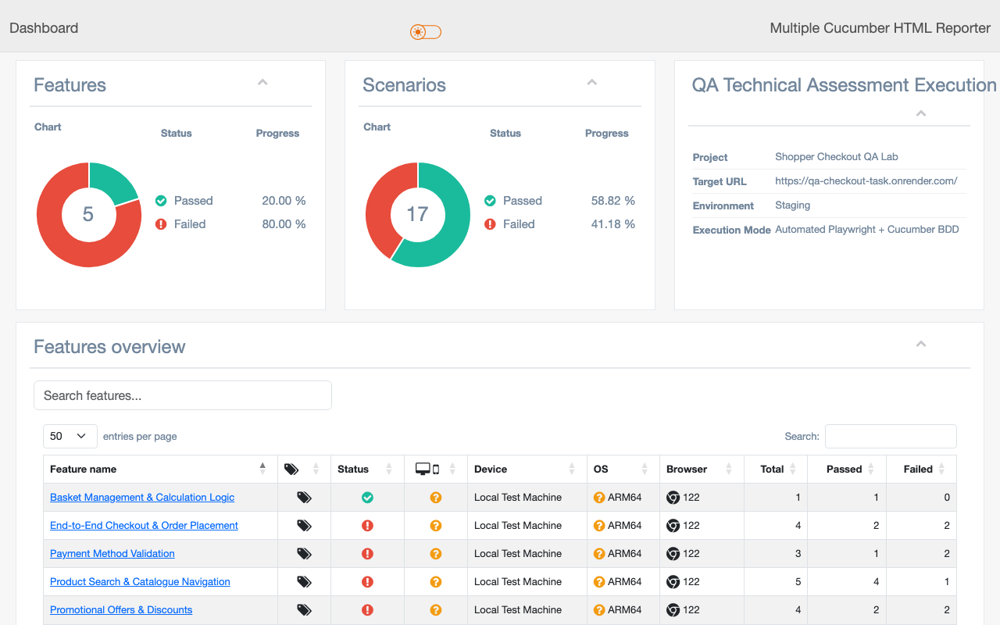
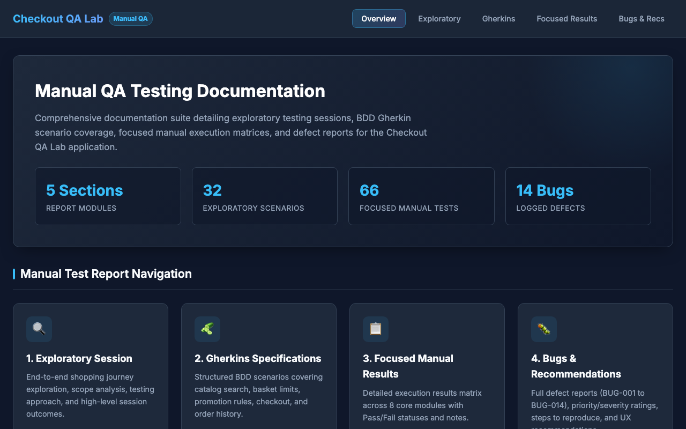

# Shopper Checkout – Quality Engineering Project


## Overview

This repository showcases an end-to-end **Quality Engineering** approach using the **Shopper Checkout** application as the system under test.

It combines exploratory testing, manual testing, Behaviour-Driven Development (BDD) and Playwright automation into a single maintainable solution.

The project demonstrates the complete software testing lifecycle—from requirements analysis and exploratory testing through manual test design, defect reporting and automated regression testing using Playwright, Cucumber BDD and TypeScript.

---

## Table of Contents

- [Overview](#overview)
- [Technology Stack](#technology-stack)
- [Key Features](#key-features)
- [Skills Demonstrated](#skills-demonstrated)
- [Repository Contents](#repository-contents)
- [Documentation](#documentation)
- [Screenshots](#screenshots)
- [Framework Design](#framework-design)
- [Project Structure](#project-structure)
- [Installation](#installation)
- [Running the Tests](#running-the-tests)
- [Automation Coverage](#automation-coverage)
- [Known Application Defects](#known-application-defects)
- [Quality Engineering Approach](#quality-engineering-approach)
- [Future Improvements](#future-improvements)
- [Author](#author)

---

## Technology Stack

- Playwright (`@playwright/test`)
- Cucumber BDD (`@cucumber/cucumber`)
- TypeScript (`ts-node`)
- Node.js
- Chai Assertions (`chai`)
- Dotenv (`dotenv`)

The selected technology stack provides a maintainable, scalable and business-focused automation solution suitable for modern Agile development teams.

---

## Key Features

- End-to-end Playwright automation
- Behaviour-Driven Development using Cucumber
- Page Object Model architecture
- Automatic test data reset
- Business-focused assertions and validations
- Interactive HTML reporting
- Defect traceability
- Manual and exploratory testing artefacts

---

## Skills Demonstrated

- Quality Engineering
- Exploratory Testing
- Manual Test Design
- Defect Reporting & Prioritisation
- Behaviour-Driven Development (BDD)
- Playwright
- TypeScript
- Page Object Model (POM)
- End-to-End Testing
- Regression Testing
- Agile Testing

---

## Repository Contents

This repository contains the following quality engineering artefacts:

| Deliverable | Description | Link |
|-------------|-------------|------|
| **Exploratory Testing Report** | Exploratory testing sessions, observations and findings. | [Exploratory Report](documentation/exploratory-testing.html) |
| **Manual Test Cases** | Functional test cases covering the application's primary business workflows. | [Manual Test Cases](documentation/manual-test-cases.html) |
| **Findings / Defect Report** | Confirmed defects with severity, priority, reproduction steps and business impact. | [Bugs & Recommendations](documentation/bugs-and-recommendations.html) / [Findings Report](FINDINGS_REPORT.md) |
| **BDD Feature Files** | Business-readable Gherkin scenarios derived from the application requirements. | [BDD Scenarios](documentation/gherkin-scenarios.html) / [Feature Files](features/) |
| **Playwright Automation Framework** | Automated regression suite developed using Playwright, Cucumber BDD and TypeScript. | [Source Code](src/) |
| **Project Documentation** | Project overview, framework design, execution instructions and implementation notes. | [README.md](README.md) |

---

## Documentation

- 📋 [Exploratory Testing Report](documentation/exploratory-testing.html)
- 📝 [Manual Test Cases](documentation/manual-test-cases.html)
- 🐞 [Findings Report](documentation/bugs-and-recommendations.html) / [Technical Defect Analysis](FINDINGS_REPORT.md)
- 🥒 [BDD Scenarios](documentation/gherkin-scenarios.html)

---

## Screenshots

### Test Execution


### HTML Report


### Quality Engineering Documentation Portal


---

## Framework Design

The automation framework has been built following industry best practices.

The framework has been designed to be easy to maintain, extend and integrate into continuous delivery pipelines.

### Design Principles

- Page Object Model (POM)
- Behaviour-Driven Development (BDD)
- Shared test data
- Reusable step definitions
- Independent test execution
- Business-focused assertions
- Clear defect traceability
- Maintainable and scalable project structure

---

## Project Structure

```text
.
├── .github/                  # GitHub Actions CI workflow configuration
│   └── workflows/
│       └── tests.yml
├── documentation/            # QA Documentation (Exploratory, Manual, BDD & Defect Reports)
│   ├── bugs-and-recommendations.html
│   ├── exploratory-testing.html
│   ├── gherkin-scenarios.html
│   ├── manual-test-cases.html
│   └── index.html
├── features/                 # Gherkin feature files (basket, checkout, payment, promotions, search)
├── reports/                  # Generated Cucumber JSON & HTML automation reports
├── screenshots/              # Test suite and report visual screenshots
├── src/
│   ├── pages/                # Page Objects (POM classes with barrel exports)
│   ├── steps/                # Cucumber step definition glue code
│   ├── support/              # Playwright hooks, browser setup, and reset helpers
│   └── testdata/             # Centralized test data fixtures and environment loaders
├── .env.example              # Template for environment variables
├── FINDINGS_REPORT.md        # Technical findings & defect analysis report
├── cucumber.js               # Cucumber configuration
├── generate-report.js        # HTML report generator script
├── package.json              # Project configuration and test scripts
└── README.md                 # Project overview and documentation
```

---

## Installation

Install project dependencies:

```bash
npm install
```

Install Playwright browsers:

```bash
npx playwright install chromium
```

---

## Running the Tests

Run the complete regression suite:

```bash
npm test
```

Run stable regression suite (excluding `@known-defect` scenarios):

```bash
npm run test:ci
```

Run individual feature areas:

```bash
npm run test:search
npm run test:basket
npm run test:promotions
npm run test:payment
npm run test:checkout
```

Generate the HTML report:

```bash
npm run test:report
```

---

## Automation Coverage

The automated regression suite covers the application's key business workflows, including:

- Product catalogue
- Product search
- Basket management
- Quantity updates
- Promotional offers
- Checkout
- Payment validation
- Order confirmation
- Order history
- Stock updates
- Duplicate order prevention

---

## Known Application Defects

A number of automated scenarios are intentionally tagged using **@known-defect**.

Confirmed application defects have intentionally been retained as executable regression tests.

Once the underlying defects are resolved, these scenarios can be moved into the standard regression suite to prevent future regressions.

Each automated scenario references the corresponding defect ID from the Findings Report, providing full traceability between documented defects and automated regression coverage.

Examples include:

- Promotional offers can be applied multiple times (`BUG-008`).
- Different promotional offers can be combined (`BUG-014`).
- A declined payment card is incorrectly accepted (`BUG-013`).
- Multiple orders can be created from repeated submissions (`BUG-010`).
- Purchased items remain in the basket after checkout (`BUG-002`).

---

## Assumptions

- Tests use the supplied test account (configured via `.env`).
- Test data is reset before each scenario (`/api/test/reset`) to ensure test independence.
- Chromium is the primary supported browser for execution.
- The application environment (`https://qa-checkout-task.onrender.com/`) is available during execution.

---

## Quality Engineering Approach

The project demonstrates the complete quality engineering process:

- Requirement analysis
- Exploratory testing
- Manual functional testing
- Test case design
- Defect reporting and prioritisation
- Behaviour-Driven Development (BDD)
- Playwright automation
- Page Object Model implementation
- Business-focused regression testing
- Traceability between requirements, defects and automated tests

---

## Future Improvements

Given additional time, the framework could be extended to include:

- Cross-browser execution (Firefox, WebKit)
- Enhanced CI pipeline with parallel execution and multi-browser testing
- Containerised execution using Docker
- Visual regression testing
- API integration testing
- Accessibility testing
- Performance testing
- Test data generation utilities
- Enhanced reporting dashboards

---

## Final Notes

This repository demonstrates how exploratory testing, manual testing, BDD, defect reporting and Playwright automation can be combined into a structured Quality Engineering approach.

Rather than focusing solely on automation, the project emphasises traceability, maintainability and confidence in software quality throughout the testing lifecycle.

---

## Author

**Venkata Saripella**  
Senior QA Automation Engineer | SDET | Quality Engineer  
*Experienced in Playwright, Selenium, Cypress, API Testing, BDD, CI/CD and Quality Engineering.*
